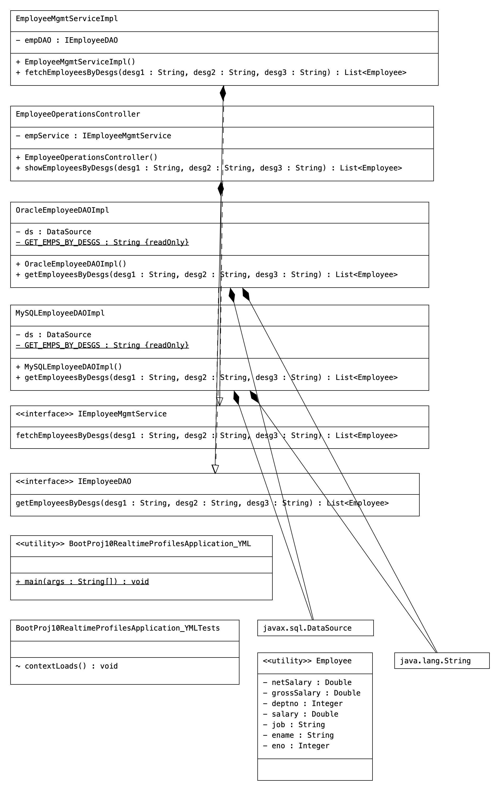

# BootProj10-RealtimeDI-MiniProject-Profiles-YML


# Code

```Java
package com.data;

import java.util.List;

import org.springframework.boot.SpringApplication;
import org.springframework.boot.autoconfigure.SpringBootApplication;
import org.springframework.boot.autoconfigure.jdbc.JdbcTemplateAutoConfiguration;
import org.springframework.context.ApplicationContext;
import org.springframework.context.ConfigurableApplicationContext;

import com.data.controller.EmployeeOperationsController;
import com.data.model.Employee;

@SpringBootApplication(exclude = JdbcTemplateAutoConfiguration.class)
public class BootProj10RealtimeProfilesApplication_YML {
	
	
	
	/*	@Bean
		public   ComboPooledDataSource   createC3P0Ds()throws Exception {
		  ComboPooledDataSource   ds=new ComboPooledDataSource();
		  ds.setDriverClass("oracle.jdbc.driver.OracleDriver");
		  ds.setJdbcUrl("jdbc:oracle:thin:@localhost:1521:xe");
		  ds.setUser("system"); ds.setPassword("manager");
		  return ds;
		}*/

    public static void main(String[] args) {
        //get  IOC container
        ApplicationContext ctx=SpringApplication.run(BootProj10RealtimeProfilesApplication_YML.class, args);
        //get access to controller class obj
        EmployeeOperationsController controller=ctx.getBean("empController",EmployeeOperationsController.class);
        // invoke the b.method
        try {
            List<Employee> list=controller.showEmployeesByDesgs("CLERK", "MANAGER", "SALESMAN");
            list.forEach(emp->{
                System.out.println(emp);
            });
        }
        catch(Exception e) {
            e.printStackTrace();
            System.out.println("Problem is code ::"+e.getMessage());
        }

        //close the IOC container
        ((ConfigurableApplicationContext) ctx).close();


    }

}
package com.data.controller;

import java.util.List;

import org.springframework.beans.factory.annotation.Autowired;
import org.springframework.stereotype.Controller;

import com.data.model.Employee;
import com.data.service.IEmployeeMgmtService;

@Controller("empController")
public class EmployeeOperationsController {
    @Autowired
    private IEmployeeMgmtService  empService;

    public EmployeeOperationsController() {
        System.out.println("EmployeeOperationsController:: 0-param constructor");
    }


    public   List<Employee>   showEmployeesByDesgs(String desg1,String desg2,String desg3)throws Exception{
        //use service
        List<Employee> list=empService.fetchEmployeesByDesgs(desg1, desg2, desg3);
        return list;
    }

}
package com.data.dao;

import java.sql.Connection;
import java.sql.PreparedStatement;
import java.sql.ResultSet;
import java.sql.SQLException;
import java.util.ArrayList;
import java.util.List;

import javax.sql.DataSource;

import org.springframework.beans.factory.annotation.Autowired;
import org.springframework.context.annotation.Profile;
import org.springframework.stereotype.Repository;

import com.data.model.Employee;

@Repository("mysqlEmpDAO")
@Profile({"dev","test"})
public class MySQLEmployeeDAOImpl implements IEmployeeDAO {
    private  static final String GET_EMPS_BY_DESGS="SELECT EMPNO,ENAME,DESG,SAL,DEPTNO FROM EMPLOYEE_TAB WHERE DESG IN(?,?,?) ORDER BY DESG ";
    @Autowired
    private  DataSource  ds;

    public MySQLEmployeeDAOImpl() {
        System.out.println("MySQLEmployeeDAOImpl:: 0-param constructor");
    }

    @Override
    public List<Employee> getEmployeesByDesgs(String desg1, String desg2, String desg3) throws Exception {
        System.out.println("EmployeeDAOImpl.getEmployeesByDesgs()::: DAtaSource obj class name::"+ds.getClass());
        List<Employee> list=null;
        try(//get  pooled connectoon from the  DataSource
            Connection con=ds.getConnection();
            //create PreparedStatemetn object  using the  con obj
            PreparedStatement ps=con.prepareStatement(GET_EMPS_BY_DESGS);
        ){  //try with resource
            //set  method args  as the  query param values
            ps.setString(1,desg1);  ps.setString(2,desg2); ps.setString(3, desg3);
            try(// execute  the SQL Query
                ResultSet rs=ps.executeQuery();
            ){   //nested try with resource
                // initialize the ArrayList
                list=new ArrayList();
                //process the ResultSet to copy its  recods  List<Employee> obj  as the Employee objs
                while(rs.next()) {
                    // copy each record  to Employee class obj
                    Employee  emp=new Employee();
                    emp.setEno(rs.getInt(1));
                    emp.setEname(rs.getString(2));
                    emp.setJob(rs.getString(3));
                    emp.setSalary(rs.getDouble(4));
                    emp.setDeptno(rs.getInt(5));
                    //add Employee class obj to List Colelction
                    list.add(emp);
                }//while
            }//try2
        }//try
        catch(SQLException se) {  //for handling known exeception
            se.printStackTrace();
            throw se; // Exeption rethrowing for Exception Propagration
        }
        catch(Exception e) {  //for handling  unknown exception
            e.printStackTrace();
            throw e;
        }
        return list;
    }//method

}//class
package com.data.dao;

import java.sql.Connection;
import java.sql.PreparedStatement;
import java.sql.ResultSet;
import java.sql.SQLException;
import java.util.ArrayList;
import java.util.List;

import javax.sql.DataSource;

import org.springframework.beans.factory.annotation.Autowired;
import org.springframework.context.annotation.Profile;
import org.springframework.stereotype.Repository;

import com.data.model.Employee;

@Repository("orampDAO")
@Profile({"uat","prod"})
public class OracleEmployeeDAOImpl implements IEmployeeDAO {
    private  static final String GET_EMPS_BY_DESGS="SELECT EMPNO,ENAME,JOB,SAL,DEPTNO FROM EMP WHERE JOB IN(?,?,?) ORDER BY JOB ";
    @Autowired
    private  DataSource  ds;

    public OracleEmployeeDAOImpl() {
        System.out.println("OracleEmployeeDAOImpl:: 0-param constructor");
    }

    @Override
    public List<Employee> getEmployeesByDesgs(String desg1, String desg2, String desg3) throws Exception {
        System.out.println("EmployeeDAOImpl.getEmployeesByDesgs()::: DAtaSource obj class name::"+ds.getClass());
        List<Employee> list=null;
        try(//get  pooled connectoon from the  DataSource
            Connection con=ds.getConnection();
            //create PreparedStatemetn object  using the  con obj
            PreparedStatement ps=con.prepareStatement(GET_EMPS_BY_DESGS);
        ){  //try with resource
            //set  method args  as the  query param values
            ps.setString(1,desg1);  ps.setString(2,desg2); ps.setString(3, desg3);
            try(// execute  the SQL Query
                ResultSet rs=ps.executeQuery();
            ){   //nested try with resource
                // initialize the ArrayList
                list=new ArrayList();
                //process the ResultSet to copy its  recods  List<Employee> obj  as the Employee objs
                while(rs.next()) {
                    // copy each record  to Employee class obj
                    Employee  emp=new Employee();
                    emp.setEno(rs.getInt(1));
                    emp.setEname(rs.getString(2));
                    emp.setJob(rs.getString(3));
                    emp.setSalary(rs.getDouble(4));
                    emp.setDeptno(rs.getInt(5));
                    //add Employee class obj to List Colelction
                    list.add(emp);
                }//while
            }//try2
        }//try
        catch(SQLException se) {  //for handling known exeception
            se.printStackTrace();
            throw se; // Exeption rethrowing for Exception Propagration
        }
        catch(Exception e) {  //for handling  unknown exception
            e.printStackTrace();
            throw e;
        }
        return list;
    }//method

}//class

package com.data.dao;

import java.util.List;

import com.data.model.Employee;

public interface IEmployeeDAO {
    public List<Employee>   getEmployeesByDesgs(String desg1,String desg2,String desg3)throws Exception;
}
package com.data.model;

import lombok.Data;

@Data
public class Employee {
    //bean properties
    private Integer eno;
    private String  ename;
    private  String job;
    private  Double salary;
    private  Integer deptno;
    private  Double grossSalary;
    private  Double netSalary;

}

package com.data.service;

import java.util.List;

import com.data.model.Employee;

public interface IEmployeeMgmtService {
    public  List<Employee>   fetchEmployeesByDesgs(String desg1,String desg2,String desg3)throws Exception;
}
package com.data.service;

import java.util.List;

import org.springframework.beans.factory.annotation.Autowired;
import org.springframework.stereotype.Service;

import com.data.dao.IEmployeeDAO;
import com.data.model.Employee;

@Service("empService")
public class EmployeeMgmtServiceImpl implements IEmployeeMgmtService {
    @Autowired
    private IEmployeeDAO  empDAO;

    public EmployeeMgmtServiceImpl() {
        System.out.println("EmployeeMgmtServiceImpl:: 0-param cosntructor");
    }

    @Override
    public List<Employee> fetchEmployeesByDesgs(String desg1, String desg2, String desg3) throws Exception {
        //use DAO
        List<Employee> list=empDAO.getEmployeesByDesgs(desg1, desg2, desg3);
        list.forEach(emp->{
            //b.logic  to calculate the grossSalary and netSalary
            emp.setGrossSalary(emp.getSalary()+(emp.getSalary()*0.4));
            emp.setNetSalary(emp.getGrossSalary()-(emp.getGrossSalary()*0.2));
        });

        return list;
    }

}


```

# UML

